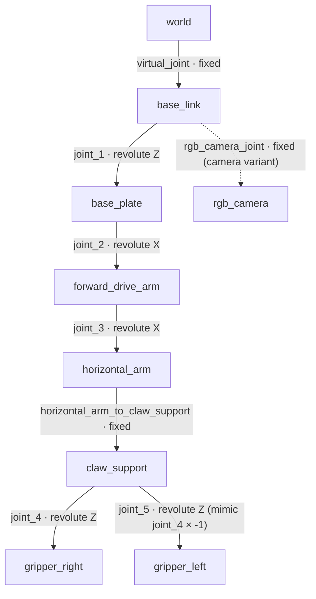

# 🤖 Arduinobot — URDF / Xacro Robot Description

A 5-DOF (4 actuated joints + mimic gripper) robotic arm modelled in **URDF/Xacro** for **ROS 2**.
This repository contains the complete robot description of *Arduinobot* — built up step by step (base → rotating plate → arm → forearm → gripper) — plus an extended variant with an **RGB camera (Raspberry Pi camera)** mounted on the base.

The model can be visualised in **RViz2**, inspected with **TF2 tools**, and used as the foundation for simulation (Gazebo), motion planning (MoveIt 2) and hardware control (`ros2_control` + Arduino).

---

## 📑 Table of Contents

1. [Features](#-features)
2. [Repository Structure](#-repository-structure)
3. [Robot Overview](#-robot-overview)
4. [Kinematic Structure & TF Tree](#-kinematic-structure--tf-tree)
5. [Link Reference](#-link-reference)
6. [Joint Reference](#-joint-reference)
7. [Xacro Properties & Macros](#-xacro-properties--macros)
8. [Incremental Build Steps](#-incremental-build-steps)
9. [Camera Variant](#-camera-variant)
10. [Prerequisites](#-prerequisites)
11. [Installation](#-installation)
12. [Usage](#-usage)
13. [Verifying the Model](#-verifying-the-model-urdf--tf)
14. [Example Launch File](#-example-launch-file)
15. [Known Limitations & Notes](#-known-limitations--notes)
16. [Roadmap](#-roadmap)
17. [Contributing](#-contributing)
18. [License](#-license)

---

## ✨ Features

- 📐 Fully parametric **Xacro** description (shared `PI`, `effort`, `velocity` properties)
- 🧩 Reusable **`default_inertial`** macro for all links
- 🦾 **Revolute** joints with defined limits (±90°) for base, shoulder and elbow
- ✋ **Two-finger gripper** driven by a single actuated joint using a **`<mimic>`** joint
- 📷 Optional **RGB camera** link fixed to the base
- 🪜 **Step-by-step files** (step 1 → step 3 → final) — great for learning how a URDF grows
- 🌲 Verified TF tree exported with `view_frames`

---

## 📁 Repository Structure

The URDF files provided in this project are:

```
.
├── arduinobot_step1_urdf.xacro      # Step 1 – base_link only
├── arduinobot_step2_urdf.xacro      # Step 2 – + world, base_plate, forward_drive_arm (joint_1, joint_2)
├── arduinobot_step3_urdf.xacro      # Step 3 – + horizontal_arm (joint_3)
├── arduinobot_final_urdf.xacro      # Final  – + claw_support, gripper_right, gripper_left (joint_4, joint_5)
├── arduino_camera_urdf.xacro        # Final + rgb_camera (fixed to base_link)
├── frames_2025-11-20_17_38_16.pdf   # TF tree exported with `view_frames`
└── README.md
```

The URDF references meshes using `package://arduinobot_description/meshes/...`, so in a real ROS 2 workspace the files are expected to live in a package named **`arduinobot_description`**. A recommended layout:

```
arduinobot_description/
├── CMakeLists.txt
├── package.xml
├── urdf/
│   ├── arduinobot_step1_urdf.xacro
│   ├── arduinobot_step2_urdf.xacro
│   ├── arduinobot_step3_urdf.xacro
│   ├── arduinobot_final_urdf.xacro
│   └── arduino_camera_urdf.xacro
├── meshes/
│   ├── basement.STL
│   ├── base_plate.STL
│   ├── forward_drive_arm.STL
│   ├── horizontal_arm.STL
│   ├── claw_support.STL
│   ├── right_finger.STL
│   ├── left_finger.STL
│   └── pi_camera.STL
├── launch/
│   └── display.launch.py
├── rviz/
│   └── display.rviz
└── docs/
    └── frames.pdf
```

> ⚠️ The `.STL` mesh files are **not** included in the uploaded files. You must add them to `meshes/` for the robot to render correctly.

---

## 🦾 Robot Overview

| Property            | Value                                                      |
|---------------------|------------------------------------------------------------|
| Robot name          | `arduinobot`                                               |
| Format              | URDF via Xacro                                             |
| Fixed frame         | `world` (attached to `base_link` by `virtual_joint`)       |
| Actuated joints     | 4 independent (`joint_1`–`joint_4`) + 1 mimic (`joint_5`)  |
| Joint type          | Revolute                                                   |
| End effector        | Two-finger parallel-style gripper                          |
| Mesh scale          | `0.01` (meshes are authored in cm → converted to m)        |
| Default effort      | 30.0                                                       |
| Default velocity    | 10.0 rad/s                                                 |

### Motion summary

| Joint     | Motion                              | Axis   |
|-----------|-------------------------------------|--------|
| `joint_1` | Base rotation (yaw)                 | Z      |
| `joint_2` | Shoulder (forward/backward tilt)    | X      |
| `joint_3` | Elbow                               | X      |
| `joint_4` | Gripper open/close (right finger)   | Z      |
| `joint_5` | Left finger — mirrors `joint_4`     | Z      |

---

## 🌲 Kinematic Structure & TF Tree

The kinematic chain of the final model:



The TF tree captured with `view_frames` (see `frames_2025-11-20_17_38_16.pdf`) confirms the following frames are being broadcast:

`world → base_link → base_plate → forward_drive_arm → horizontal_arm → claw_support → gripper_right / gripper_left`

- Moving joints (`base_plate`, `forward_drive_arm`, `gripper_right`, `gripper_left`) are published by `robot_state_publisher` at ≈ **10.2 Hz**.
- Static/fixed transforms (`base_link`, `horizontal_arm`, `claw_support`) show up as static frames.

---

## 🔗 Link Reference

| Link                | Mesh file              | Mass (kg) | Visual/Collision origin (xyz)   | Visual/Collision rpy            |
|---------------------|------------------------|-----------|---------------------------------|---------------------------------|
| `world`             | — (virtual)            | —         | —                               | —                               |
| `base_link`         | `basement.STL`         | 1.0       | `-0.5 -0.5 0`                   | `0 0 0`                         |
| `base_plate`        | `base_plate.STL`       | 0.1       | `-0.39 -0.39 -0.56`             | `0 0 0`                         |
| `forward_drive_arm` | `forward_drive_arm.STL`| 0.1       | `0.19 0.06 -0.08`               | `0 -π/2 π/2`                    |
| `horizontal_arm`    | `horizontal_arm.STL`   | 0.1       | `-0.03 -0.4 -0.06`              | `π/2 0 π/2`                     |
| `claw_support`      | `claw_support.STL`     | 0.05      | `0 -0.05 -0.15`                 | `0 0 π/2`                       |
| `gripper_right`     | `right_finger.STL`     | 0.01      | `-0.1 0.50 -0.1`                | `0 0 -π/2`                      |
| `gripper_left`      | `left_finger.STL`      | 0.01      | `-0.04 0.50 -0.1`               | `0 0 -π/2`                      |
| `rgb_camera` *(camera variant)* | `pi_camera.STL` | 0.01 | visual `0 0.13 -0.13` | visual `3.14 -1.57 0`     |

All meshes use `scale="0.01 0.01 0.01"`. Every link has both `<visual>` and `<collision>` geometry (identical meshes).

---

## 🔩 Joint Reference

| Joint                            | Type     | Parent → Child                    | Origin (xyz)          | Axis    | Lower      | Upper     |
|----------------------------------|----------|-----------------------------------|-----------------------|---------|------------|-----------|
| `virtual_joint`                  | fixed    | `world` → `base_link`             | `0 0 0`               | —       | —          | —         |
| `joint_1`                        | revolute | `base_link` → `base_plate`        | `0 0 0.307`           | `0 0 1` | `-π/2`     | `π/2`     |
| `joint_2`                        | revolute | `base_plate` → `forward_drive_arm`| `-0.02 0 0.35`        | `1 0 0` | `-π/2`     | `π/2`     |
| `joint_3`                        | revolute | `forward_drive_arm` → `horizontal_arm` | `0 0 0.8`        | `1 0 0` | `-π/2`     | `π/2`     |
| `horizontal_arm_to_claw_support` | fixed    | `horizontal_arm` → `claw_support` | `0 0.82 0`            | —       | —          | —         |
| `joint_4`                        | revolute | `claw_support` → `gripper_right`  | `-0.04 0.13 -0.1`     | `0 0 1` | `-π/2`     | `0`       |
| `joint_5`                        | revolute | `claw_support` → `gripper_left`   | `-0.22 0.13 -0.1`     | `0 0 1` | `0`        | `π/2`     |
| `rgb_camera_joint` *(camera variant)* | fixed | `base_link` → `rgb_camera`    | `0 0.35 0.20` (rpy `0 0 1.5708`) | — | —     | —         |

All revolute joints use **effort = 30.0** and **velocity = 10.0**.

### 🪞 Gripper mimic joint

`joint_5` (left finger) is declared as a mimic of `joint_4`:

```xml
<mimic joint="joint_4" multiplier="-1"/>
```

So you only command **`joint_4`**; the left finger automatically moves in the opposite direction, giving a symmetric open/close motion with a single actuator.

---

## ⚙️ Xacro Properties & Macros

```xml
<xacro:property name="PI"       value="3.14159265359" />
<xacro:property name="effort"   value="30.0" />
<xacro:property name="velocity" value="10.0" />
```

```xml
<xacro:macro name="default_inertial" params="mass">
    <inertial>
        <origin xyz="0 0 0" rpy="0 0 0"/>
        <mass value="${mass}" />
        <inertia ixx="1.0" ixy="0.0" ixz="0.0"
                 iyy="1.0" iyz="0.0"
                 izz="1.0" />
    </inertial>
</xacro:macro>
```

Usage inside a link:

```xml
<link name="base_plate">
    <xacro:default_inertial mass="0.1"/>
    ...
</link>
```

---

## 🪜 Incremental Build Steps

The repo keeps each milestone so you can follow how the URDF is developed:

| File                             | What it adds                                                                                             | Links | Joints |
|----------------------------------|----------------------------------------------------------------------------------------------------------|:-----:|:------:|
| `arduinobot_step1_urdf.xacro`    | Inertial macro + `base_link` (basement mesh)                                                             | 1     | 0      |
| `arduinobot_step2_urdf.xacro`    | Properties, `world`, `base_plate`, `forward_drive_arm`, `virtual_joint`, `joint_1`, `joint_2`             | 4     | 3      |
| `arduinobot_step3_urdf.xacro`    | `horizontal_arm`, `joint_3`                                                                              | 5     | 4      |
| `arduinobot_final_urdf.xacro`    | `claw_support`, `gripper_right`, `gripper_left`, fixed support joint, `joint_4`, `joint_5` (mimic)        | 8     | 7      |
| `arduino_camera_urdf.xacro`      | Final model + `rgb_camera` and `rgb_camera_joint`                                                        | 9     | 8      |

---

## 📷 Camera Variant

`arduino_camera_urdf.xacro` extends the final model with a Pi Camera:

- **Link:** `rgb_camera` — mesh `pi_camera.STL`, blue material (`rgba = 0.0 0.5 1.0 1.0`), mass `0.01 kg`, small diagonal inertia (`1e-6`).
- **Joint:** `rgb_camera_joint` (fixed) from `base_link`, origin `xyz="0 0.35 0.20"`, `rpy="0 0 1.5708"`.
- The file contains **commented-out earlier attempts** at the camera link/joint that are kept for reference of the tuning process.

To use the camera in simulation you would additionally add a Gazebo `<sensor type="camera">` plugin (see [Roadmap](#-roadmap)).

---

## 📦 Prerequisites

- **Ubuntu 22.04 / 24.04** (or another platform supported by your ROS 2 distro)
- **ROS 2** (Humble, Iron, Jazzy or newer)
- ROS 2 packages:

```bash
sudo apt update
sudo apt install \
  ros-$ROS_DISTRO-xacro \
  ros-$ROS_DISTRO-robot-state-publisher \
  ros-$ROS_DISTRO-joint-state-publisher-gui \
  ros-$ROS_DISTRO-rviz2 \
  ros-$ROS_DISTRO-tf2-tools \
  liburdfdom-tools
```

> `liburdfdom-tools` provides `check_urdf` and `urdf_to_graphiz`.

---

## 🛠️ Installation

```bash
# 1. Create a workspace
mkdir -p ~/arduinobot_ws/src
cd ~/arduinobot_ws/src

# 2. Clone this repository
git clone https://github.com/<your-username>/<your-repo>.git arduinobot_description

# 3. Make sure the STL meshes are inside arduinobot_description/meshes/

# 4. Build
cd ~/arduinobot_ws
colcon build --symlink-install

# 5. Source the workspace
source install/setup.bash
```

> Make sure your `CMakeLists.txt` installs the resource folders:
>
> ```cmake
> install(DIRECTORY urdf meshes launch rviz
>   DESTINATION share/${PROJECT_NAME}
> )
> ```

---

## ▶️ Usage

### 1. Expand Xacro into plain URDF

```bash
xacro src/arduinobot_description/urdf/arduinobot_final_urdf.xacro > /tmp/arduinobot.urdf
```

### 2. Visualise in RViz2 with sliders

```bash
ros2 launch arduinobot_description display.launch.py
```

Then in RViz2:

1. Set **Fixed Frame** → `world`
2. Add **RobotModel** → *Description Topic* = `/robot_description`
3. Add **TF** to see all coordinate frames
4. Move the joints with the **Joint State Publisher GUI** sliders

### 3. Choose a model variant

```bash
# Final robot (no camera)
ros2 launch arduinobot_description display.launch.py model:=arduinobot_final_urdf.xacro

# Robot with RGB camera
ros2 launch arduinobot_description display.launch.py model:=arduino_camera_urdf.xacro

# Learning steps
ros2 launch arduinobot_description display.launch.py model:=arduinobot_step2_urdf.xacro
```

---

## ✅ Verifying the Model (URDF & TF)

**Validate the URDF syntax and tree:**

```bash
xacro urdf/arduinobot_final_urdf.xacro > /tmp/arduinobot.urdf
check_urdf /tmp/arduinobot.urdf
```

**Generate a link/joint graph:**

```bash
urdf_to_graphiz /tmp/arduinobot.urdf
```

**Export the live TF tree** (this is how `frames_2025-11-20_17_38_16.pdf` was created):

```bash
ros2 run tf2_tools view_frames
```

**Inspect a specific transform:**

```bash
ros2 run tf2_ros tf2_echo world gripper_right
```

**Manually move a joint (without the GUI):**

```bash
ros2 topic pub /joint_states sensor_msgs/msg/JointState \
  "{name: ['joint_1','joint_2','joint_3','joint_4','joint_5'], position: [0.5, 0.3, -0.4, -0.5, 0.5]}"
```

---

## 🚀 Example Launch File

`launch/display.launch.py`:

```python
import os
from ament_index_python.packages import get_package_share_directory
from launch import LaunchDescription
from launch.actions import DeclareLaunchArgument
from launch.substitutions import Command, LaunchConfiguration, PathJoinSubstitution
from launch_ros.actions import Node
from launch_ros.parameter_descriptions import ParameterValue
from launch_ros.substitutions import FindPackageShare


def generate_launch_description():
    pkg = "arduinobot_description"

    model_arg = DeclareLaunchArgument(
        name="model",
        default_value="arduinobot_final_urdf.xacro",
        description="Xacro file to load from the urdf/ folder",
    )

    robot_description = ParameterValue(
        Command([
            "xacro ",
            PathJoinSubstitution([FindPackageShare(pkg), "urdf", LaunchConfiguration("model")]),
        ]),
        value_type=str,
    )

    robot_state_publisher = Node(
        package="robot_state_publisher",
        executable="robot_state_publisher",
        parameters=[{"robot_description": robot_description}],
    )

    joint_state_publisher_gui = Node(
        package="joint_state_publisher_gui",
        executable="joint_state_publisher_gui",
    )

    rviz = Node(
        package="rviz2",
        executable="rviz2",
        arguments=["-d", os.path.join(get_package_share_directory(pkg), "rviz", "display.rviz")],
        output="screen",
    )

    return LaunchDescription([model_arg, robot_state_publisher, joint_state_publisher_gui, rviz])
```

---

## ⚠️ Known Limitations & Notes

- **Placeholder inertia:** the `default_inertial` macro uses `ixx = iyy = izz = 1.0` for every link regardless of mass. This is fine for visualisation but **not physically accurate**; compute proper inertia tensors (e.g. from CAD/MeshLab) before using Gazebo or other physics simulators.
- **Mesh dependency:** STL files must be present in `meshes/` and the package name must be `arduinobot_description`.
- **Mesh origins are hand-tuned:** the visual/collision offsets (e.g. `-0.39 -0.39 -0.56`) compensate for the mesh coordinate origins and were adjusted manually.
- **Uniform joint limits:** all joints share `effort = 30` and `velocity = 10`; adjust them to match your real servo specifications.
- **Camera collision origin:** in the camera variant, the camera's collision origin (`0 0 0`) differs from its visual origin (`0 0.13 -0.13`, `rpy 3.14 -1.57 0`). Align them if you rely on collision checking.
- **No `<transmission>` / `ros2_control` tags yet:** required before controlling the arm via controllers or hardware.
- **Camera-related frames** (`rgb_camera`) are not present in the exported TF PDF, which was captured from the model without the camera.

---
---

## 👤 Author - Mukul Dabas

**Your Name** — [@your-github-username](https://github.com/your-github-username)

> If you found this project useful, please ⭐ the repository!
